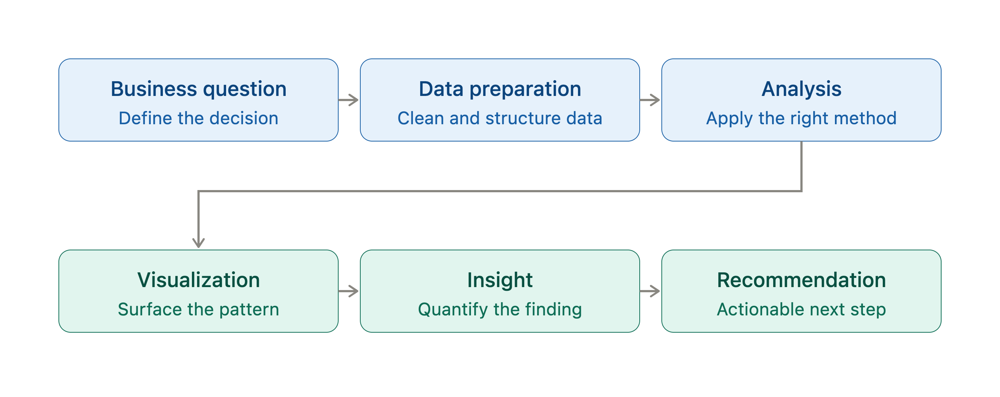

# Data Analytics Portfolio

A curated collection of end-to-end data analytics projects demonstrating practical skills in data preparation, SQL, Power BI, Excel, Python, statistical analysis, and business intelligence.

Each project follows a business-focused workflow.
The goal is to translate complex datasets into clear, actionable insights that support better business decisions.

## Projects

## Business Intelligence & Dashboarding

### 1. Retail Sales Performance & Profit Analytics
**Focus :** Sales analytics · Commercial analytics · Management reporting

Analysed 9,994 retail transactions to identify revenue, profitability, discounting and customer-segment drivers. Built an executive Power BI dashboard and translated findings into actionable recommendations for improving profit performance.

**Technical Skills :** Power BI · DAX · Power Query

→ [View Project](https://github.com/zcthinn/retail-sales-powerbi-dashboard)

---

### 2. Logistics Performance Analytics

**Focus :** Operations analytics · Logistics · KPI reporting

Analysed logistics operations to identify the drivers behind delivery delays, customer satisfaction and capacity issues. Built interactive Power BI dashboards covering delivery performance, driver/vehicle performance and hub capacity.

**Technical Skills :** Power BI · DAX · Power Query

→ [View Project](https://github.com/zcthinn/Logistics-Performance-Analytics)

---

### 3. Hotel Booking Cancellation Risk & Business Impact

**Focus :** Hospitality analytics · Revenue analytics · Business reporting

Analysed hotel booking cancellations to understand revenue exposure, cancellation patterns and differences between hotel segments. Developed an interactive dashboard to support cancellation-risk and revenue-management decisions.

**Technical Skills :** Excel · Statistical Analysis · Business Intelligence

→ [View Project](https://github.com/zcthinn/hotel-booking-cancellation-analysis)

---

## SQL & Workforce Analytics

### 4. Employee & Workforce Analytics

**Focus :**  HR analytics · SQL analysis · Workforce reporting

Built a SQL-based workforce analysis examining organisational structure, compensation, promotions, employee performance and workforce trends using advanced relational queries and window functions.

**Technical Skills :** MySQL · Advanced SQL · Window Functions

→ [View Project](https://github.com/zcthinn/Employee-Workforce-Analytics-SQL)

---

## Python Data Analysis

### 5. Electronics Store Sales Analysis

**Focus :** Python analytics · Exploratory data analysis · Sales analytics

Analysed approximately 186K electronics transactions to identify monthly sales trends, geographic performance, purchasing patterns and product-level opportunities.

**Technical Skills :** Python · pandas · Matplotlib · Plotly

→ [View Project](https://github.com/zcthinn/Electronic-Store-Sales-Data-Analysis)

---

### 6. Movies Data Analysis
**Focus :**  Python analytics · Exploratory analysis · Statistical analysis

Performed large-scale exploratory analysis of movie budgets, revenue, profitability, ratings and genre performance to identify relationships between production investment and commercial outcomes.

**Technical Skills :** Python · pandas · Matplotlib

→ [View Project](https://github.com/zcthinn/Movies-Data-Analysis)

---

## Technical Skill Set

- **BI & Reporting:** Power BI, DAX, Power Query, Microsoft Excel
- **SQL & Databases:** SQL, MySQL, Advanced SQL, Window Functions
- **Python & Analytics:** Python, pandas, Matplotlib, Plotly, Jupyter Notebook
- **Data Modelling:** Star Schema, Relational Data Modelling, Data Transformation
- **Statistical Analysis:** Descriptive Statistics, Multivariate Analysis, Scenario Analysis, Risk Assessment
- **Data Quality:** Data Validation, QA Cross-Validation, Data Cleaning

---

## Analytical Approach

I focus on turning raw data into clear business insights by combining data preparation, analytical modelling, visualization, and structured problem-solving.

My approach is to move beyond reporting surface-level metrics and identify the underlying drivers of business performance, then translate those findings into practical recommendations.

---

## Connect With Me

- **GitHub:** [@zcthinn](https://github.com/zcthinn)
- **LinkedIn:** [Zar Chi Thinn](https://www.linkedin.com/in/zar-chi-thinn/)
